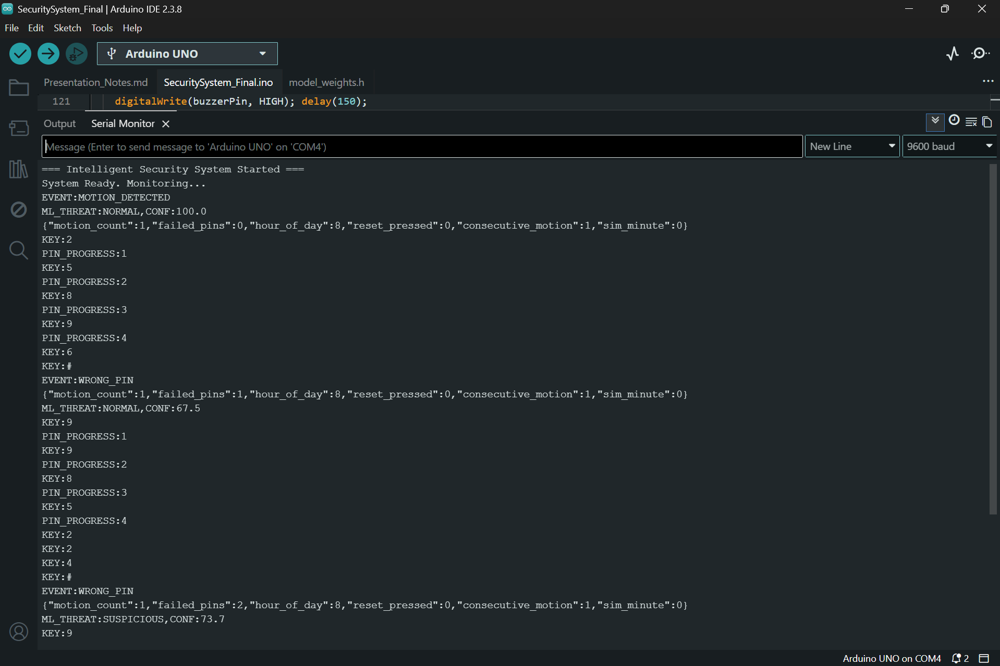
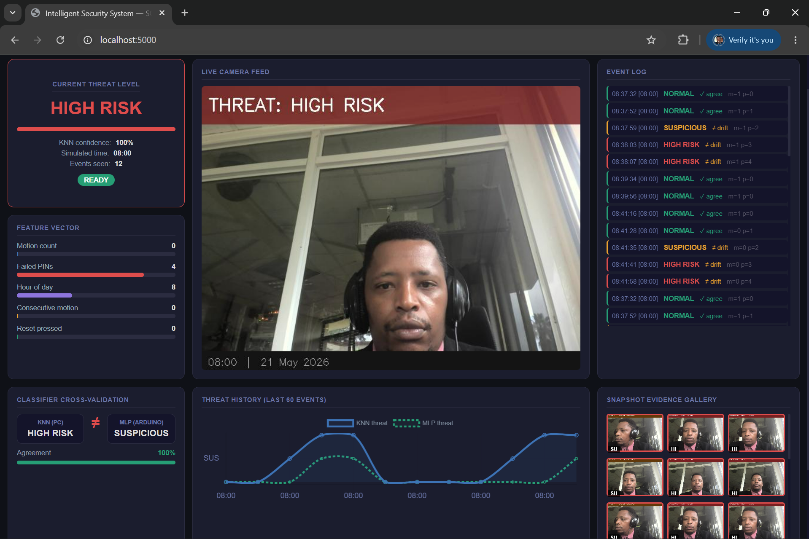
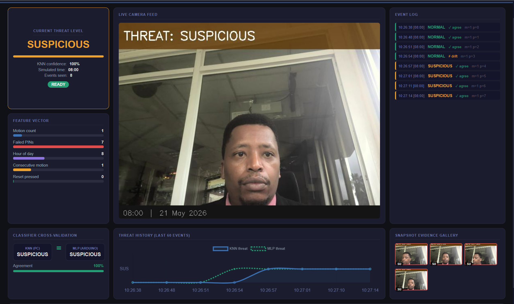
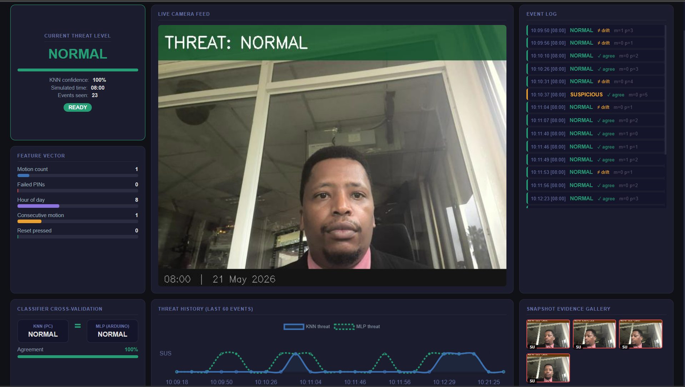

# 🔐 Intelligent Edge Security System

> **TinyML access control on Arduino Uno — 123-parameter MLP running entirely on-chip, no cloud, no internet, under KES 7,000 in components.**

[](https://www.arduino.cc/)
[](https://python.org)
[](https://flask.palletsprojects.com/)
[](https://opencv.org/)
[](https://scikit-learn.org/)
[](LICENSE)
[]()

---

## ⚠️ Hardware-Dependent Project — Read Before Cloning

This system requires **physical hardware** (Arduino Uno, PIR sensor, 4×4 keypad, LEDs, buzzer). It cannot be deployed as a live web app.

**Three ways to experience it without hardware:**
1. **[Run the simulation](#-demo-simulation)** — pure Python, simulates all sensor events, shows the full dashboard
2. **[Watch the demo video](#demo-video)** — screen recording of all 12 test scenarios passing on real hardware
3. **[Read the technical report](docs/MSc_Technical_Report.pdf)** — full architecture, AI training, and results documentation

---

## Table of Contents

- [Project Overview](#project-overview)
- [System Architecture](#system-architecture)
- [AI / ML Design](#ai--ml-design)
- [Hardware Setup](#hardware-setup)
- [Software Installation](#software-installation)
- [Demo Simulation](#-demo-simulation)
- [Running with Real Hardware](#running-with-real-hardware)
- [Test Results](#test-results)
- [Screenshots](#screenshots)
- [Repo Structure](#repo-structure)
- [Academic Context](#academic-context)

---

## Project Overview

Conventional door locks in Kenyan rental properties have no threat intelligence. A tenant sharing their PIN, a landlord who forgot to rekey, and a determined intruder running brute-force attempts all look identical to a dumb lock. Commercial smart lock alternatives (August, Schlage, Yale) cost KES 15,000–60,000 per unit — entirely outside the budget of the target demographic.

This system occupies the gap: **machine learning threat classification at the hardware cost of a school science project.**

### What it does

| Capability | Detail |
|---|---|
| **Edge ML inference** | 123-parameter MLP neural network runs on the Arduino Uno's ATmega328P — no server, no internet |
| **Dual-classifier architecture** | Independent KNN (PC) + MLP (Arduino) run simultaneously; disagreement triggers drift detection |
| **5-state threat engine** | `READY → ALERT → SUSPICIOUS → HIGH_RISK → LOCKOUT` with proportional LED + buzzer response |
| **Camera evidence capture** | OpenCV webcam snapshot with threat overlay on `SUSPICIOUS` or `HIGH_RISK` classification |
| **Live monitoring dashboard** | Flask + Socket.IO dashboard with threat history chart, KNN vs MLP comparison panel, evidence gallery |
| **Offline-first** | Full door access control including ML inference runs with zero network connectivity |
| **Target cost** | < KES 7,000 total component BOM |

### Threat Classification

| Class | Trigger Conditions | System Response |
|---|---|---|
| `NORMAL (0)` | ≤1 failed PIN, expected motion for time of day | Green LED, double beep |
| `SUSPICIOUS (1)` | 2 failed PINs; or high night-time motion; or consecutive motion without PIN attempt | Amber LED, camera snapshot |
| `HIGH RISK (2)` | ≥3 failed PINs; or failed PIN + nocturnal high motion | Red LED, urgent triple beep, camera snapshot |
| `LOCKOUT` | 5 consecutive failures | All LEDs, persistent buzz — requires **physical button reset** |

---

## System Architecture

```
┌──────────────────────────────────────────────────────────┐
│                    EDGE LAYER (Arduino Uno)               │
│                                                          │
│  PIR Sensor ──┐                                          │
│               ├─► Feature Engineering ──► MLP Inference  │
│  4×4 Keypad ──┘   (5 features, MinMax    (5→6→3, PROGMEM │
│                    normalised, 60s window) ReLU, argmax)  │
│                         │                     │          │
│                         ▼                     ▼          │
│                   5-State Machine ──► LED + Buzzer        │
│                   (READY/ALERT/                           │
│                   SUSPICIOUS/HIGH_RISK/LOCKOUT)           │
│                         │                                 │
│                   JSON Serial ──────────────────────────► │
└─────────────────────────────────────────────────────────-┘
                          │ USB Serial @ 9600 baud
┌─────────────────────────▼────────────────────────────────┐
│                    PC LAYER (Python)                      │
│                                                          │
│  Serial Reader ──► KNN Classifier ──► Compare vs MLP     │
│       │            (k=3, NumPy,        (drift detection:  │
│       │            97.2% LOOCV)        3 disagreements    │
│       │                                → DRIFT_WARNING)   │
│       │                                                   │
│       ├──► Flask + Socket.IO Dashboard                    │
│       │    (threat gauge, event log,                      │
│       │     KNN/MLP panel, evidence gallery)              │
│       │                                                   │
│       └──► OpenCV Camera Manager                          │
│            (JPEG snapshot + overlay on threat events)     │
└──────────────────────────────────────────────────────────┘
```

### Feature Vector

Five features feed both classifiers, derived from three physical sensors:

| # | Feature | Sensor | Range | Notes |
|---|---|---|---|---|
| 0 | `motion_count` | HC-SR501 PIR | 0–20+ | Events in 60-second rolling window |
| 1 | `failed_pins` | 4×4 Keypad | 0–5 | Cumulative wrong PINs in session |
| 2 | `consecutive_motion` | PIR (derived) | 0 / 1 | PIR triggered on 2+ successive cycles without PIN attempt |
| 3 | `reset_pressed` | Push button (A1) | 0 / 1 | Physical landlord override |
| 4 | `hour_of_day` | millis() clock | 0–23 | Temporal context — same motion count is more suspicious at 03:00 than 14:00 |

---

## AI / ML Design

### MLP — Arduino Edge (SecuritySystem_Final.ino + model_weights.h)

```
Architecture:  5 → 6 → 3  (input → hidden → output)
Parameters:    123 floats stored in PROGMEM (Arduino flash)
Activation:    ReLU (hidden), argmax (output)
Training:      scikit-learn MLPClassifier, Adam, 1000 iterations
Dataset:       36 labelled samples, 12 per class, balanced
CV Accuracy:   100% (5-fold stratified) — see note below
Flash usage:   ~2.5 KB of 32 KB available
SRAM usage:    Weights read via pgm_read_float(), zero SRAM overhead
```

> **On the 100% accuracy:** The training dataset uses deterministic labelling rules (e.g., `failed_pins >= 3` → always High Risk). This creates linearly separable classes, making 100% CV accuracy expected and correct — not a sign of overfitting. The 123-parameter model is deliberately underpowered relative to dataset size, which structurally prevents memorisation. Real-world deployment would extend the dataset with passively collected events.

### KNN — PC Layer (Assignment5_KNN_Camera.py)

```
Algorithm:     K-Nearest Neighbours, k=3
Distance:      Euclidean (NumPy, from scratch — no sklearn at inference)
Dataset:       72 labelled samples, 24 per class
LOOCV:         97.2% accuracy
Role:          Independent classifier + drift detection + camera trigger
```

### Drift Detection

After every event, KNN result is compared against the `ML_THREAT` field from the Arduino JSON. Three consecutive disagreements log a `DRIFT_WARNING` — a computable signal that sensor conditions or input distribution have shifted, prompting retraining without manual log inspection.

### Training Pipeline

```
ml_training/Assignment6_EdgeML.py
    │
    ├── Train MLP (scikit-learn)
    ├── 5-fold stratified cross-validation
    ├── Export weights → arduino/SecuritySystem_Final/model_weights.h
    │   (PROGMEM C arrays, pgm_read_float() compatible)
    └── Export scaler → python/scaler_params.py
```

---

## Hardware Setup

### Bill of Materials

| Component | Role | Est. Cost (KES) |
|---|---|---|
| Arduino Uno (ATmega328P) | Edge compute, ML inference | 1,200 |
| HC-SR501 PIR sensor | Motion detection | 250 |
| 4×4 matrix keypad | PIN input | 300 |
| Active buzzer | Audible alerts | 100 |
| Red LED + 220Ω resistor | High Risk indicator | 50 |
| Green LED + 220Ω resistor | Normal / correct PIN | 50 |
| Amber LED + 220Ω resistor | Alert / Suspicious | 50 |
| Push button | Physical reset (Landlord override) | 50 |
| Jumper wires + breadboard | Connections | 400 |
| USB A-B cable | Arduino–PC serial link | 200 |
| **Total** | | **< KES 2,650** |

> PC/laptop with webcam not included — uses existing hardware.

### Pin Allocation

```
Arduino Pin    │ Connected To
───────────────┼──────────────────────────────
2, 3, 4, 5    │ Keypad rows R1–R4
6              │ Keypad column C1
7              │ PIR sensor signal output
8              │ Active buzzer
9              │ Keypad column C2
10             │ Keypad column C3
11             │ Amber LED (anode → 220Ω → pin)
12             │ Green LED (anode → 220Ω → pin)
13             │ Red LED   (anode → 220Ω → pin)
A0             │ Keypad column C4
A1             │ Reset button (INPUT_PULLUP, GND on press)
```

### Wiring Notes

- **LEDs**: Anode → 220Ω resistor → Arduino pin. Cathode → GND.
- **PIR**: VCC → 5V rail. GND → GND. OUT → pin 7. Adjust sensitivity via onboard potentiometers (both fully clockwise for maximum range).
- **Reset button**: One leg → A1. Other leg → GND. No external resistor needed (`INPUT_PULLUP` provides internal pull-up).
- **Keypad**: Uses `Keypad` Arduino library. Row/column mapping matches `SecuritySystem_Final.ino` constants — do not rearrange.
- **Buzzer**: Positive → pin 8. Negative → GND. Driven by `tone()` — active buzzer only, not passive.

See [`docs/wiring/`](docs/wiring/) for annotated connection diagram.

---

## Software Installation

### Arduino (Firmware)

**Prerequisites:**
- [Arduino IDE 2.x](https://www.arduino.cc/en/software)
- Board: Arduino Uno
- Libraries (install via Library Manager):
  - `Keypad` by Mark Stanley, Alexander Brevig

**Steps:**
```bash
# 1. Open arduino/SecuritySystem_Final/SecuritySystem_Final.ino in Arduino IDE
# 2. model_weights.h is in the same folder — Arduino IDE includes it automatically
# 3. Select board: Tools → Board → Arduino Uno
# 4. Select port: Tools → Port → (your COM port / /dev/ttyUSB0)
# 5. Upload (Ctrl+U)
```

**Configure start hour** (for demo/testing):
```cpp
// SecuritySystem_Final.ino, line ~15
#define START_HOUR 22  // Start at 22:00 to trigger nocturnal threat logic immediately
```

### Python (Dashboard + KNN)

```bash
# Clone the repo
git clone https://github.com/wahomekevinmwas/Intelligent-Edge-Security-System.git
cd Intelligent-Edge-Security-System

# Create virtual environment
python -m venv venv
source venv/bin/activate  # Windows: venv\Scripts\activate

# Install dependencies
pip install -r requirements.txt

# Configure serial port (edit python/config.py)
SERIAL_PORT = 'COM3'      # Windows
# SERIAL_PORT = '/dev/ttyUSB0'  # Linux
# SERIAL_PORT = '/dev/cu.usbmodem1401'  # macOS

# Run the dashboard
python python/Assignment5_KNN_Camera.py
# Open browser: http://localhost:5000
```

**Camera index:** If your webcam doesn't open, edit `python/Assignment5_KNN_Camera.py`:
```python
self.cap = cv2.VideoCapture(0)  # Try 0, 1, or 2
```

---

## 🎮 Demo Simulation

**No Arduino required.** The simulation script replays all 12 test scenarios, generates realistic sensor events, runs the KNN classifier, and serves the full Flask dashboard.

```bash
# Activate virtual environment first
source venv/bin/activate

# Run simulation
python simulation/demo_simulation.py

# Open browser: http://localhost:5000
# Watch all 5 threat states cycle automatically
```

**What the simulation covers:**

| Scenario | State Reached | Duration |
|---|---|---|
| Normal access — correct PIN | `READY` | 8s |
| Single wrong PIN | `ALERT` | 8s |
| Two wrong PINs + camera trigger | `SUSPICIOUS` | 10s |
| Three wrong PINs + snapshot | `HIGH_RISK` | 10s |
| Five consecutive failures | `LOCKOUT` | 8s |
| Physical reset recovery | `READY` | 5s |
| Night-time motion escalation | `SUSPICIOUS` | 10s |
| Drift detection — forced disagreement | `DRIFT_WARNING` | 15s |
| De-escalation — 2-minute quiet period | `READY` | 12s |

The simulation injects events into the same Flask/Socket.IO pipeline as the real hardware, so the dashboard behaviour is **identical** to live operation.

---

## Running with Real Hardware

Once the Arduino is flashed and Python dependencies are installed:

```bash
# Terminal 1: Verify Arduino is transmitting
python -c "
import serial, time
s = serial.Serial('COM3', 9600, timeout=2)
for _ in range(10):
    line = s.readline().decode().strip()
    if line: print(line)
"
# Should show JSON: {"motion":0,"failed_pins":0,...,"ML_THREAT":0,"state":"READY"}

# Terminal 2: Launch full system
python python/Assignment5_KNN_Camera.py
# Browser: http://localhost:5000
```

**Testing sequence:**
1. Walk past PIR → watch system enter `ALERT`, amber LED on
2. Press wrong PIN 3 times → watch escalation through `SUSPICIOUS` → `HIGH_RISK`
3. Check `docs/screenshots/snapshots/` for camera evidence captures
4. Press wrong PIN 5 times → `LOCKOUT`
5. Press physical reset button → return to `READY`

---

## Test Results

All 12 test scenarios verified on physical hardware:

| Scenario | Result |
|---|---|
| Normal access — correct PIN on first attempt | ✅ PASS |
| ALERT — single wrong PIN, amber LED | ✅ PASS |
| SUSPICIOUS — two wrong PINs + camera snapshot | ✅ PASS |
| HIGH RISK — three wrong PINs + urgent beep | ✅ PASS |
| LOCKOUT — five wrong PINs, keypad disabled | ✅ PASS |
| LOCKOUT release — physical reset button (A1) | ✅ PASS |
| De-escalation — 2-minute quiet period → READY | ✅ PASS |
| KNN-MLP agreement on normal events | ✅ PASS |
| Drift detection — 3× forced disagreement → DRIFT_WARNING | ✅ PASS |
| LED feedback — all states (red/green/amber) | ✅ PASS |
| JSON serial output — correct structure, all fields | ✅ PASS |
| PROGMEM weight access — MLP inference on-chip | ✅ PASS |

---

## Screenshots

> Screenshots captured from physical hardware testing. See [`docs/screenshots/`](docs/screenshots/) for full resolution.

| Arduino Serial Monitor | Flask Dashboard — HIGH RISK |
|---|---|
|  |  |

| Camera Evidence — SUSPICIOUS | Camera Evidence — NORMAL |
|---|---|
|  |  |

---

## Repo Structure

```
intelligent-edge-security/
│
├── arduino/
│   └── SecuritySystem_Final/
│       ├── SecuritySystem_Final.ino   # Main Arduino firmware
│       └── model_weights.h            # MLP weights in PROGMEM C arrays
│
├── python/
│   ├── Assignment5_KNN_Camera.py      # KNN classifier + Flask dashboard + camera
│   └── config.py                      # Serial port, camera index, paths
│
├── ml_training/
│   └── Assignment6_EdgeML.py          # MLP training, weight export, KNN training
│
├── simulation/
│   └── demo_simulation.py             # Hardware-free demo — runs full pipeline
│
├── docs/
│   ├── MSc_Technical_Report.pdf       # Full academic report with architecture detail
│   ├── screenshots/
│   │   ├── serial_monitor.png
│   │   ├── dashboard_high_risk.png
│   │   ├── camera_suspicious.png
│   │   └── camera_normal.png
│   └── wiring/
│       └── wiring_diagram.md          # Pin connections and assembly guide
│
├── requirements.txt
├── .gitignore
└── README.md
```

---

## Academic Context

This project was submitted as the MSc Mini Project for **SCS 6106: Embedded Intelligent Systems**, Department of Computing and Informatics, University of Nairobi (2025).

**Research question:** To what extent can behavioural features derived from low-cost embedded sensors predict door access threat level when processed through a dual-model ML pipeline across two deployment tiers?

**Key contributions:**
- Proof-of-concept that MLP inference is viable on a commodity microcontroller (ATmega328P, 32KB flash) with no cloud dependency
- Dual-classifier drift detection architecture — KNN/MLP disagreement as a computable retraining signal
- Sub-KES 7,000 component cost for a system that replicates cloud-subscription-gated features of commercial smart locks

**Related projects:**

- [livestock-monitor](https://github.com/wahomekevinmwas/livestock-monitor) — Django livestock disease monitoring
- [agroinfoshield](https://github.com/wahomekevinmwas/agroinfoshield) — multilingual RAG fact-checking dashboard
---

## License

MIT License — see [LICENSE](LICENSE) for details.

---

*Built for SCS 6106: Embedded Intelligent Systems · University of Nairobi MSc Computer Science · 2025*
